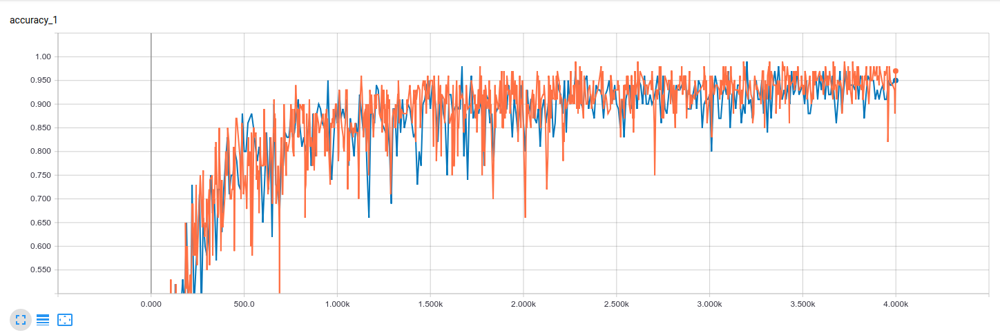
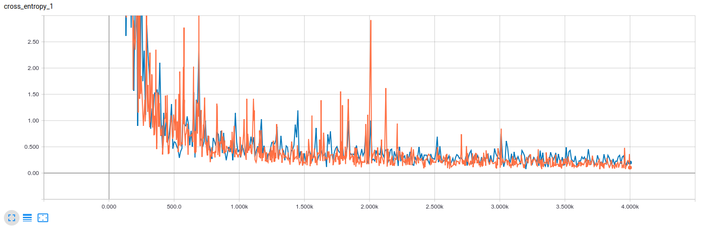

# distracted-driver-detection
Deep learning framework for detection of distracted drivers using images from a dashboard camera

## training
We obtain an accuracy of 94.1% with a 90-10 split on the training data. We've used the mobilenet architecture with the pretrained weights from imagenet. The dataset is publically available on kaggle [here](https://www.kaggle.com/c/state-farm-distracted-driver-detection/data). Following are the descriptions of predicted classes:
* c0: safe driving
* c1: texting - right
* c2: talking on the phone - right
* c3: texting - left
* c4: talking on the phone - left
* c5: operating the radio
* c6: drinking
* c7: reaching behind
* c8: hair and makeup
* c9: talking to passenger

## how to use
1. Training: *sh train.sh $train_dir$*
  
2. Testing: *sh test.sh $test_img$*

## android application
Yes, we did port this to android !! Not that it was too difficult but still :). We provide and Android studio project that can be found at ./android/tfmobile. Simply compile to get yourself the apk

